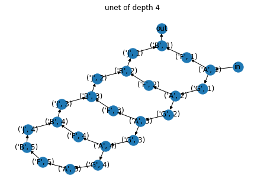
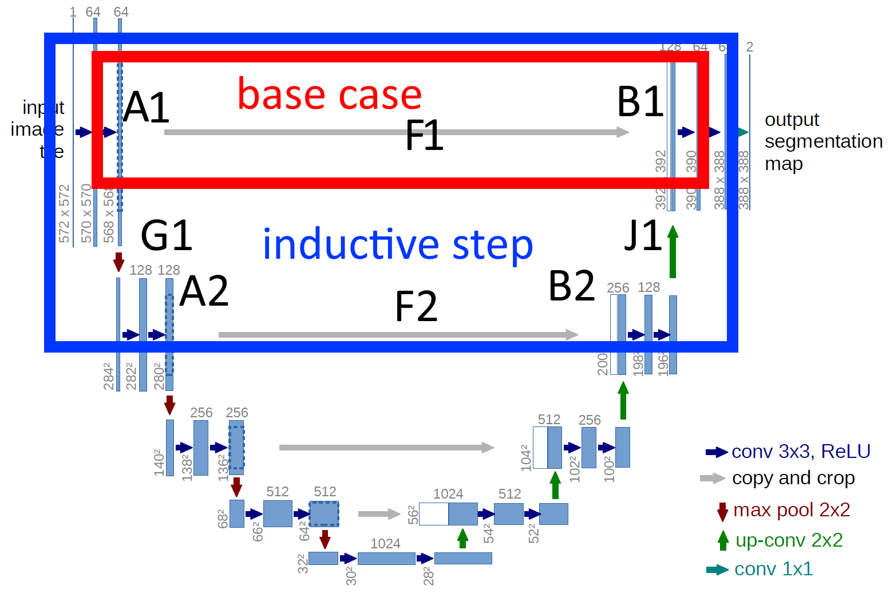

# a dsl for generating recursive neural network architectures

The syntax is quite similar to a subset of mermaid.js, with one additional constraint:
- nodes must be of the form `<variable>_<n>`

Then you provide diagrams for the base case and the inductive step and specify how many times to apply the inductive step.

## example: unet

```python:
from interpret import DslInterpreter

"""
base case:
a1 ---f1---> b1

inductive step:
a1 -------f1------ > b1
\                   ^
 \ g1            j1/
  \>a2 ---f2--> b2/


to apply again, increment all numbers by 1 and repeat inductive step

e.g. depth 3:
a1 ----f1---- b1
\g1          /j1
 a2 ---f2---b2
  \g2      /j2
   a3--f3--b3
"""

base_case = """
graph LR
    A_1 --> F_1 %% enc conv -> copy and crop
    F_1 --> B_1 %% copy and crop -> dec conv
"""

inductive_step = """
graph LR
    A_1 --> G_1 %% enc conv -> maxpool
    G_1 --> A_2 %% maxpool -> enc conv
    A_2 --> F_2 %% enc conv -> copy and crop
    F_2 --> B_2 %% copy and crop -> dec conv
    B_2 --> J_1 %% dec conv -> up conv
    J_1 --> B_1 %% up conv -> dec conv
"""

unet_4 = DslInterpreter().apply(base_case, inductive_step, times=4)

G = nx.DiGraph()
for statement in unet_4:
    G.add_edge(statement[0], statement[1])
G.add_edge("in", ("A", 1))
G.add_edge(("B", 1), "out")

pos = nx.kamada_kawai_layout(G)
nx.draw(G, pos, with_labels=True)
labels = nx.get_edge_attributes(G, 'label')
nx.draw_networkx_edge_labels(G, pos, edge_labels=labels)
plt.title("unet of depth 4")
plt.show()
```


which yields




Simple!



## as mermaid:

base case
```
graph LR
    A_1 --> F_1 %% enc conv -> copy and crop
    F_1 --> B_1 %% copy and crop -> dec conv
```

```mermaid
graph LR
    A_1 --> F_1 %% enc conv -> copy and crop
    F_1 --> B_1 %% copy and crop -> dec conv
```

inductive step
```
graph LR
    A_1 --> G_1 %% enc conv -> maxpool
    G_1 --> A_2 %% maxpool -> enc conv
    A_2 --> F_2 %% enc conv -> copy and crop
    F_2 --> B_2 %% copy and crop -> dec conv
    B_2 --> J_1 %% dec conv -> up conv
    J_1 --> B_1 %% up conv -> dec conv
```
```mermaid
graph LR
    A_1 --> G_1 %% enc conv -> maxpool
    G_1 --> A_2 %% maxpool -> enc conv
    A_2 --> F_2 %% enc conv -> copy and crop
    F_2 --> B_2 %% copy and crop -> dec conv
    B_2 --> J_1 %% dec conv -> up conv
    J_1 --> B_1 %% up conv -> dec conv
```

---
*this part not implemented yet*

To make the full module, you just provide 2 dicts of higher-order functions that define

- constructors for the modules
- the forward pass definitions


### Constructors
Constructors return a *function*, i.e. `module_n = construct(n)()`. 

Continuing with the unet example, the `a` modules correspond to the convolutions that multiply the channels:


```python
# enc conv
def mk_a(n):
    base_dim = 64

    def a_maker():
        n_in = base_dim // (2**(n-1))
        n_out = base_dim // (2**n)
        return nn.Sequential(
            nn.Conv2d(n_in, n_out, kernel=3, padding='same'),
            nn.BatchNorm2d(out_channels)
            nn.ReLU(),
            nn.Conv2d(n_in, n_out, kernel=3, padding='same'),
        )
    
    return a_maker     
```


```python
constructors = {
    'a': mk_a,
    'b': mk_b,
    'f': lambda n: nn.Identity, # copy and crop is not really a module - it can be defined all in the forward pass
    ...,
}
```


### Forward pass definitions:

Dict of higher order functions that produce functions that

1. accept kwargs of inputs
2. return a dict of outputs

A few attributes will be added to the function:
- `.n`: the index, e.g. `a_n(3).n = 3`
- `.self`: the constructed module
- `.variables`: a dict for mapping variables of indexes to the actual number in this specific fwd pass (see below for more details)

e.g.

```python
def fwd_a(n): 
    def a_n(g_n):
        h = a_n.self(g_n)
        return {"f_n": h, "g_n": h} # routing multiple outputs
    return a_n

def fwd_b(n):
    def b_n(f_n, j_n): # taking multiple inputs
        h = a_n.self(f_n + j_n)
        return {"j_n": h}
    return b_n

def fwd_f(n):
    # copy and crop after considering padding loss
    # these calculations effectively get precomputed!
    size_a = 572
    padding_loss = 4
    for _ in range(n):
        size_a //= 2
        size_a -= padding_loss
        size_b = size_a * 2
    
    crop_w = crop_h = size_b
    a_center = size_a // 2

    a_x0, a_x1 = a_center - crop_w // 2, a_center + crop_w // 2
    a_y0, a_y1 = a_center - crop_h // 2, a_center + crop_h // 2
    
    def f_n(a_n):
        return a_n[:, :, a_y0:a_y1, a_x0:a_x1]
    return f_n
```

### use a custom fwd for a specific node

eg for the `in` and `out` nodes
```python
# imagine 'in' were not a python reserved keyword for this illustration..

# a_1(in=...) -> {"f_n": ..., "g_n": ..., }
def a_1(in): 
    h = a_1.self(in)
    return {"f_n": h, "g_n": h}


# b_1(j_n=...) -> {"out": ...}
def b_1(j_n):
    return {"out": b_1.self(j_n)}

fwds = {
    'a_1': lambda n: a_1 
    'a': fwd_a, 

    'b_1': lambda n: b_1
    'b': fwd_b, 

    'f': fwd_f,
    ...
}
```

---
### Variable-indexed kwargs

If you need to distinguish multiple inputs of the same kind of var e.g. 

```
c_3(c_1=..., c_2=...,)
```

then just make sure the kwargs use different letters for the variable names after the underscore; 

```
c_n(c_i=..., c_j=...)
```

The mapping from kwarg name -> variable number will be available to the function as an attribute, e.g.

```python
def fwd_c(n):
    def c_n(c_i, c_j):
        print(c_n.self.variables['c_i'], c_n.self.variables['c_j'])
    return c_n

# then later
fwds = {
    ...,
    'c': fwd_c,
    ...,
}

# c_3 forward prints "1 2"
```
